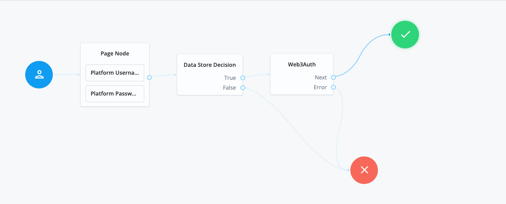

<!--
 * The contents of this file are subject to the terms of the Common Development and
 * Distribution License (the License). You may not use this file except in compliance with the
 * License.
 *
 * You can obtain a copy of the License at legal/CDDLv1.0.txt. See the License for the
 * specific language governing permission and limitations under the License.
 *
 * When distributing Covered Software, include this CDDL Header Notice in each file and include
 * the License file at legal/CDDLv1.0.txt. If applicable, add the following below the CDDL
 * Header, with the fields enclosed by brackets [] replaced by your own identifying
 * information: "Portions copyright [year] [name of copyright owner]".
 *
 * Copyright 2023 ForgeRock AS.
-->
# Web3Auth

A simple authentication node for ForgeRock's [Identity Platform][forgerock_platform] 7.3.0 and above. This node uses <strong>Web3Auth </strong>which is a pluggable wallet infrastructure for 
Web3 wallets and applications. It streamlines the onboarding of both mainstream and crypto native users in under a minute by providing experiences that they're most comfortable with. With support for all OAuth based logins systems, web & mobile native platforms, Web3Auth provides a seamless onboarding experience for your users.

Copy the .jar file from the ../target directory into the ../web-container/webapps/openam/WEB-INF/lib directory where AM is deployed.  Restart the web container to pick up the new node.  The node will then appear in the authentication trees components palette.

**USAGE HERE**

## Inputs

`None`

## Configuration
<table>
	<tr>
		<th>Property</th>
		<th>Usage</th>
        <th>Default</th>
	</tr>
    <tr>
		<td>* Username Attribute</td>
        <td>The attribute name that contains the unique username that will be provided to Web3Auth</td>
	    <td>username</td>
    </tr>
	<tr>
		<td>* Client ID </td>
        <td>Client ID from the Web3Auth Dashboard</td>
        <td>N/A</td>
	</tr>
    <tr>
		<td>* Private JWK</td>
        <td>The private portion of the JWK used to sign the JWT sent to Web3Auth</td>
	    <td>N/A</td>
     </tr>
     <tr>
		<td>* Web3Auth Network</td>
        <td>Get your Network from Web3Auth Dashboard</td>
        <td>sapphire_mainnet</td>
	</tr>
     <tr>
		<td>* JWT Time-to-live</td>
        <td>Time-to-live in milliseconds</td>
        <td>2000</td>
	</tr>
    <tr>
		<td>* Chain Namespace</td>
        <td>The Compatible Chain to use</td>
        <td>eip155</td>
	</tr> 
    <tr>
		<td>* Chain ID</td>
		<td>The chain id of the chain</td>
        <td>0x1</td>
	</tr>
    <tr>
		<td>* RPC Target</td>
		<td>RPC target Url for the chain</td>
        <td>https://rpc.ankr.com/eth</td>
	</tr> 
    <tr>
		<td>* Display Name</td>
		<td>* Display Name for the chain</td>
        <td>Ethereum Mainnet</td>
	</tr> 
    <tr>
		<td>* Block Explorer</td>
		<td>Url of the block explorer</td>
        <td>https://etherscan.io/</td>
	</tr>
    <tr>
		<td>* Ticker</td>
		<td>Default currency ticker of the network (e.g: ETH)</td>
        <td>ETH</td>
	</tr>
    <tr>
		<td>* Ticker Name</td>
		<td>Name for currency ticker (e.g: Ethereum)</td>
        <td>Ethereum</td>
	</tr>
    <tr>
		<td>* Verifier Identifier</td>
		<td>The unique identifier for your custom authentication registration on the auth network</td>
        <td>N/A</td>
	</tr>
   

</table>
* = Required

## Outputs

`None`

## Outcomes

<code>Next</code>
 Successfully retrieved the wallet and stores the sessionID in the FR secure session 

<code>Error</code>
    Could not retrieve the wallet and store the sessionID in the FR secure session
## Troubleshooting

Review the log messages to find the reason for the error and address the issue appropriately.

Click here for <a href="https://web3auth.io/docs/what-is-web3auth">Documentation</a>

## Example Journey

 
